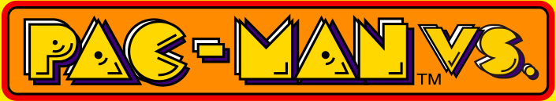
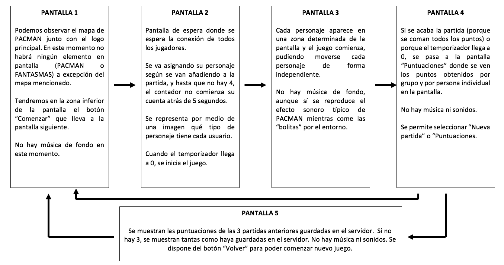
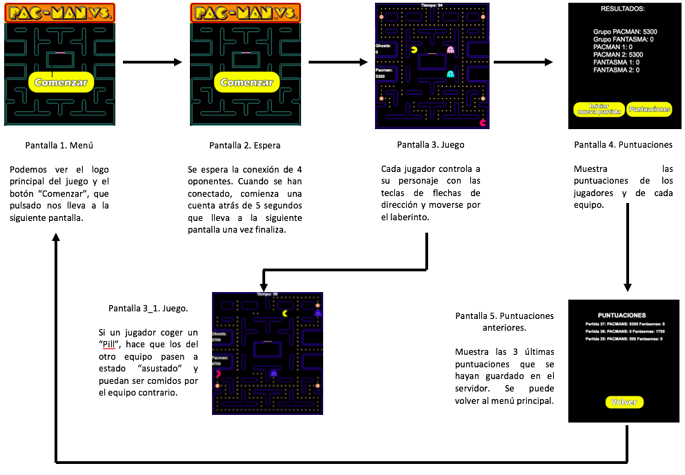

# PACMANVS
PACMAN GAME FOR NETWORK

**TITULO DEL JUEGO: PAC-MAN VS.**

**DESCRIPCIÓN DE LA TEMÁTICA DEL JUEGO**

¡PAC-MAN HA VUELTO! Pero adaptándose a las jugabilidades de hoy en día, para dar un cambio fresco y nuevo a sus mecánicas ya conocidas.
¿Qué serás en cada partida? ¿PAC-MAN? ¿O alguno de los fantasmas?. Lucha por conseguir la mayor puntuación y por atrapar a tu rival. Todo cuenta. Power-Ups, cocos... 
Trabaja en equipo y consigue derrotar a tu rival. Podrás jugar con tus amigos a través de la red y dar caza a tus rivales.

**MECÁNICAS JUGABLES**

En PACMAN VS. Tendremos la posibilidad de pertenecer a uno de los dos equipos. El equipo fantasma y el equipo PACMAN: el equipo PACMAN tendrá dos integrantes y el fantasma, otros dos. La selección será de forma automática. Ambos personajes podrán comer los distintos "cocos" distribuidos por todo el mundo.

Si dos personajes opuestos chocan entre sí, ambos morirán y volverán al lugar de partida de cada uno de los equipos.

Ambos equipos dispondrán de PowerUps (Pills). Como en el juego original, si PACMAN recoge un PowerUp, podrá durante un tiempo determinado y atacar a los miembros del equipo contrario "comiéndoselos" y obteniendo 150 puntos extra para su equipo. La diferencia es que el equipo fantasma también podrá hacer lo mismo, por lo que obtener la mayor puntuación para tu equipo será una dura batalla. 

**NUMERO DE USUARIOS**

4 jugadores podrán unirse de forma simultánea a la partida. No podrá haber menos, puesto que no está contemplado que los personajes restantes se controlen por CPU.

**CONTROLES**

Se deberá probar con diferentes configuraciones, comprobando cuál es la más adecuada para el usuario, puesto que tenemos que dividir el teclado en 4, dando a su vez 4
teclas para cada jugador. Al realizarse en local, habrá que comprobar qué teclas podemos permitir. De forma online, las teclas serán "WASD".

**CONTROLES FINALES EN LOCAL**

---PACMAN 1

-W-> Moverse hacia arriba

-A-> Moverse hacia la izquierda

-S-> Moverse hacia abajo

-D-> Moverse hacia la derecha

---PACMAN 2

-T-> Moverse hacia arriba

-F-> Moverse hacia la izquierda

-G-> Moverse hacia abajo

-H-> Moverse hacia la derecha

---FANTASMA 1

-I-> Moverse hacia arriba

-J-> Moverse hacia la izquierda

-K-> Moverse hacia abajo

-L-> Moverse hacia la derecha

---FANTASMA 2

-FLECHA_ARRIBA-> Moverse hacia arriba

-FECHA_IZQUIERDA-> Moverse hacia la izquierda

-FLECHA_ABAJO-> Moverse hacia abajo

-FLECHA_DERECHA-> Moverse hacia la derecha

**CONTADORES**

Durante la partida las vidas de los equipos será infinita. Aún así, habrá un medidor de tiempo en la parte central y superior de la pantalla, con una duración aproximada
de 2 minutos. Cada equipo deberá obtener la mayor cantidad de puntos posibles para poder ganar. En la parte superior izquierda aparecerá el contador de los puntos del 
equipo al que perteneces y en la parte superior derecha, la del equipo rival.

**RANKING**

Está previsto añadir un ranking con la puntuación de los diferentes equipos para cada vez que termine una partida. Puede valorarse la inclusión de cuántos puntos ha
obtenido también cada jugador de forma individual, aunque está pendiente de testeo y funcionalidad.

**INTEGRANTES:** 

-INTEGRANTE 1: Laura Hidalgo Rueda. 			CORREO: l.hidalgor@alumnos.urjc.es 	CUENTA EN GITHUB: darku97

-INTEGRANTE 2: Iván Críspulo Martín de Eugenio García. 	CORREO: ic.marting@alumnos.urjc.es 	CUENTA EN GITHUB: ivanmartin

-INTEGRANTE 3: Álvaro Jesús Rodríguez Nomparte. 	CORREO: aj.rodriguezn@alumnos.urjc.es 	CUENTA EN GITHUB: alvarete212

**DESCRIPCION DE PANTALLAS**
 
Las pantallas y como se consigue acceder a ellases bastante simple. Se ha uilizado como base el PACMAN original, que únicamente mostraba un escenario y pantalla. Por ello, hemos añadido para comenzar partida un botón de comienzo y además, las puntuaciones individuales de cada personaje, porque recordemos que estamos ante un videojuego para 4 personas que se unirán por la red. Tenemos 3 pantallas principales, y se puede acceder a ella tal y como se muestra a continuación.

Actualización: Se añade una pantalla adicional una vez se finaliza la partida, en el que se mostrarán las últimas tres partidas jugadas.

Actualización 2: Se ha añadido la pantalla de espera de de conexión.

**PANTALLAS FINALES**

Una vez terminado el juego, podemos ver las diferentes pantallas que se muestran. La funcionalidad no cambia con respecto al diagrama anteriormente presentado, por lo que la funcionalidad es la misma. Se muestra ya con los cambios gráficos finales. Si fuese necesario, puede sufrir cambios debido a la integración en diferentes equipos.

Actualización: Se ha añadido la imagen final correspondiente a la pantalla de puntuaciones.

Actualización 2: Se ha añadido la imagen de la pantalla de espera.

**DIAGRAMA UML**

El siguiente diagrama UML del juego. Se compone de las clases Puntuacion, PuntuacionesController, RestEjem1bApplication y las asociaciones que se establecen entre ellas. Se han incluido los métodos POST y GET porque se consideran importantes dentro de lo que es el uso de la aplicación.

Actualización: Se han añadido los elementos referentes a la parte de Websockets, que son las clases Pacman, Partida y Jugador. Pacman tendrá dos HashMap, referentes a sessions y partidas. En partida tendremos un arraylist de los jugadores. En Jugador, lo que tendremos serán las propias sessions, que se asignarán a cada jugador.

**INSTRUCCIONES DE EJECUCIÓN**

**Para ejecutar el juego se deben seguir los siguientes pasos:**

1.-Descomprimir el .zip correspondiente al repositorio

2.-Disponer los archivos en la ruta del ordenador deseada.

3.-Ir a la ruta "PACMANVS\servidor_pacman\target",

4.-Ejecutar el archivo pacmanvs-v2.0.jar

5.-Ejecutar el explorador web(preferentemente Google Chrome)

6.-Insertar esta URL: localhost:8080/pacman.html

**Si se produce algún fallo:** 

1.- Comprobar que se tiene descargado jre 1.8 de java.

2.-Descomprimir libreriaGson.zip, situado en la raíz del repositorio.

3.-Copiar los archivos en la siguiente ruta: C:\Program Files\Java\jre1.8.0_151\lib\ext

4.-Volver a ejecutar el juego.

**PROTOCOLO WEBSOCKETS**

El protocolo empleado en PACMANVS es el siguiente. 

El servidor tiene disponible todos los archivos del juego para su ejecución. Una vez se realiza la conexión entre todos los dispositivos, en una pantalla de previa al juego se esperan a los jugadores necesarios para comenzar la ejecución, que deben ser de 4. Los mensajes que se envían entre los dispositivos están compuestos de una función y los parámetros que se desean analizar en ellos. 

Ya sea un mensaje enviado como recibido, se envía una cadena de texto (aunque se hace en formato "JSON") que luego se convertirá para poder leer todos los atributos enviados de forma más sencilla y así poder trabajar con ellos ya sea en el cliente o en el servidor, manejándolos de la forma adecuada.

Se especifican a continuación el tipo de mensajes y variables utilizados en la aplicación.

-->Por parte del servidor.

El método que gestiona todos los envíos y recepciones de mensajes es el método handleTextMessage. En él, se recibe la sesión del websocket que hemos creado (relacionado con la partida) y el mensaje que hemos introducido en éste. Dependiendo de la información, tenemos;
--->Si dentro del nodo tenemos que la variable listo existe, ponemos en todos los persojanes la variable a true para poder comenzar la partida nueva y llamar a la función que lo gestiona, "comenzarPartida()".
--->Si en el nodo tenemos la variable "nueva_partida" procederemos a gestionar la creación de la nueva partida (es decir, hemos abierto por primera vez, por ejemplo, el navegador) llamando a los métodos correspondientes primero dentro del servidor.
--->Si enviamos la información de destruir, destruiremos la partida en la que nos encontrábamos, para poder gestionar siguientes.
--->Si no se cumple ninguna de las anteriores, damos por hecho que estamos en la partida y llamámos al método "sendOtherParticipants()" que busca actualizar la información de cada uno de los personajes opuestos al que controlamos en nuestra pantalla.

Dentro del método sendOtherParticipants() gestionamos toda la información que deseamos mandar a los equipos cliente. Creamos así todos los nodos necesarios, que contendrán la información de:

-Función ------> Contiene la función a la que llamamos en JavaScript

-Nombre  ------> Nombre del personaje

-id      ------> Identificador

-Direccion ----> Dirección a la que se mueve

-PosX    ------> Posiciones actuales en el eje X

-PosY    ------> Posiciones actuales en el eje Y

-Ataque  ------> Si está atacando a los demás personajes.

Así pues se envía la información a JavaScript y éste es capaz de gestionar la información gracias a un Array de funciones que se han creado en el videojuego. Éstas son principalmente:

---> setJugador(): Que lo que hace, es configurar nuestro jugador principal, asignándonos imagen, controles, etc.

---> playTheGame(): Llama a la función para comenzar el juego.

---> Actualizar(): Actualiza las posiciones de los PacMan y/o fantasmas que no controlamos.

Tengamos en cuenta que al estar aplicando los estados de Phaser para cambiar entre pantallas, una vez abrimos el HTML, TODOS los estados se cargan a la vez en memoria y residen en ella. Es decir, no por llamar al fichero "pacman.js" después de "espera.js" las variables y/o funciones de "espera.js" no van a ser accesibles. Esto nos permite tener el código más claro.

Una vez llega un mensaje del websocket, se analiza la información parseándolo en JSON y se accede a la función que se estaba llamando en ese momento.

Cabe destacar que el personaje que controlamos se hace con las flechas de dirección y que sólo nos actualizamos nuestra comprobación de teclas, al igual que sólo iremos actualizando la posición de los contrarios. 

Al mandar la posición de los personajes contrarios, deberemos ir coprobando también sus colisiones con el mundo y si han cogido o no puntos, al igual que pills, aunque debido a los datos que se envían, JavaScript es capaz de gestionar todo ello de forma independiente.

**DEMOSTRACIÓN**

https://www.youtube.com/watch?v=AmGX1b4pLFM&feature=youtu.be
