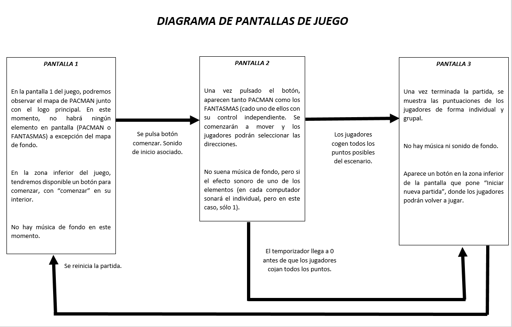

# PACMANVS
PACMAN GAME FOR NETWORK

TITULO DEL JUEGO: PAC-MAN VS.

DESCRIPCIÓN DE LA TEMÁTICA DEL JUEGO: ¡PAC-MAN HA VUELTO! Pero adaptándose a las jugabilidades de hoy en día, para dar un cambio fresco y nuevo a sus mecánicas ya conocidas.
¿Qué serás en cada partida? ¿PAC-MAN? ¿O alguno de los fantasmas?. Lucha por conseguir la mayor puntuación y por atrapar a tu rival. Todo cuenta. Power-Ups, cocos... 
Trabaja en equipo y consigue derrotar a tu rival. Podrás jugar con tus amigos a través de la red y dar caza a tus rivales.

MECÁNICAS JUGABLES.
En PACMAN VS. Tendremos la posibilidad de pertenecer a uno de los dos equipos. El equipo fantasma y el equipo PACMAN: el equipo PACMAN tendrá dos integrantes y el fantasma, otros dos. La selección será de forma automática. Ambos personajes podrán comer los distintos "cocos" distribuidos por todo el mundo.

Si dos personajes opuestos chocan entre sí, ambos morirán y volverán al lugar de partida de cada uno de los equipos, no pudiendo volver a la partida en unos 5-10 segundos.
Ambos equipos dispondrán de dos PowerUps. Como en el juego original, si PACMAN recoge un PowerUp, podrá durante unos 10 segundos atacar a los miembros del equipo contrario "comiéndoselos" y obteniendo 150 puntos extra para su equipo. La diferencia es que el equipo fantasma también podrá hacer lo mismo, por lo que obtener la mayor puntuación para tu equipo será una dura batalla. 

También aparecerán de forma aleatoria, durante la duración del juego Frutas que, al obtenerse, subirán en 100 puntos el marcador del equipo que la haya obtenido. 

NUMERO DE USUARIOS.
4 jugadores podrán unirse de forma simultánea a la partida. No podrá haber menos, puesto que no está contemplado que los personajes restantes se controlen por CPU.

CONTROLES.
Se deberá probar con diferentes configuraciones, comprobando cuál es la más adecuada para el usuario, puesto que tenemos que dividir el teclado en 4, dando a su vez 4
teclas para cada jugador. Al realizarse en local, habrá que comprobar qué teclas podemos permitir. De forma online, las teclas serán "WASD".
-W-> Moverse hacia arriba
-A-> Moverse hacia la izquierda
-S-> Moverse hacia abajo
-D-> Moverse hacia la derecha

CONTADORES.
Durante la partida las vidas de los equipos será infinita. Aún así, habrá un medidor de tiempo en la parte central y superior de la pantalla, con una duración aproximada
de 2 minutos. Cada equipo deberá obtener la mayor cantidad de puntos posibles para poder ganar. En la parte superior izquierda aparecerá el contador de los puntos del 
equipo al que perteneces y en la parte superior derecha, la del equipo rival.

RANKING
Está previsto añadir un ranking con la puntuación de los diferentes equipos para cada vez que termine una partida. Puede valorarse la inclusión de cuántos puntos ha
obtenido también cada jugador de forma individual, aunque está pendiente de testeo y funcionalidad.

INTEGRANTES: 

-INTEGRANTE 1: Laura Hidalgo Rueda. 			CORREO: l.hidalgor@alumnos.urjc.es 	CUENTA EN GITHUB: darku97

-INTEGRANTE 2: Iván Críspulo Martín de Eugenio García. 	CORREO: ic.marting@alumnos.urjc.es 	CUENTA EN GITHUB: ivanmartin

-INTEGRANTE 3: Álvaro Jesús Rodríguez Nomparte. 	CORREO: aj.rodriguezn@alumnos.urjc.es 	CUENTA EN GITHUB: alvarete212

# DESCRIPCION DE PANTALLAS
 
Las pantallas y como se consigue acceder a ellases bastante simple. Se ha uilizado como base el PACMAN original, que únicamente mostraba un escenario y pantalla. Por ello, hemos añadido para comenzar partida un botón de comienzo y además, las puntuaciones individuales de cada personaje, porque recordemos que estamos ante un videojuego para 4 personas que se unirán por la red. Tenemos 3 pantallas principales, y se puede acceder a ella tal y como se muestra a continuación.

